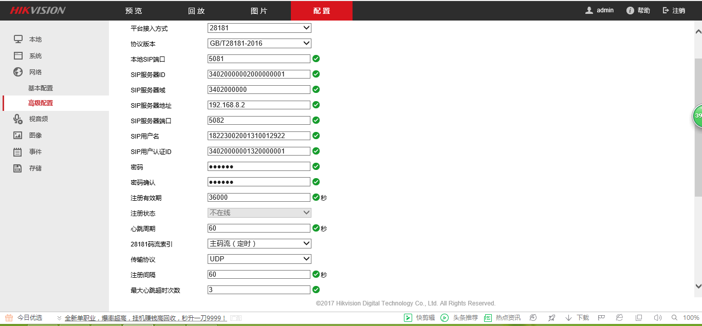

                                                      基于GB28181的简单服务器
一、介绍  
这是一个简单的基于GB28181协议的视频流服务器  
二、推流格式  
目前只支持H264裸流，后续会加上其他流格式的推流和直播  
三、配置  
1、相机配置（目前以海康为例）  
  
2、服务端配置  
四、程序架构图  
五、打赏  
如果您绝对这次修改和完善对您有帮助，不妨打赏一下  

